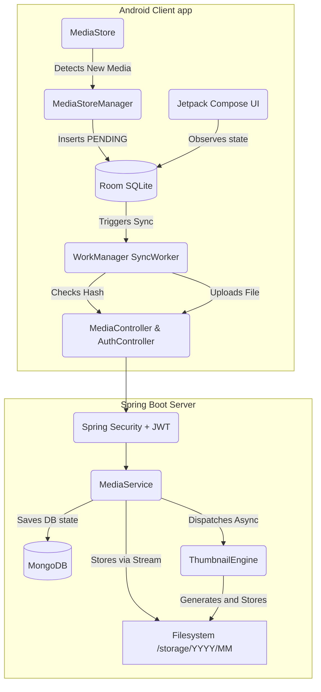

# ☁️ Nimbus: Your Personal Self-Hosted Photo Cloud

[](https://opensource.org/licenses/MIT)
[](https://spring.io/projects/spring-boot)
[](https://kotlinlang.org/)
[](https://www.docker.com/)

**Nimbus** is a production-grade, self-hosted photo backup and gallery system, designed to give you full control over your media. Think of it as a private, localized version of Google Photos that runs on your own hardware.

---

## ✨ Features

-  **Automatic Background Sync**: Uses Android `WorkManager` to detect and upload new media even when the app is closed.
-  **De-duplication**: Intelligent SHA-256 hashing ensures no redundant files are uploaded.
-  **Asynchronous Thumbnails**: Server-side thumbnail generation for fast gallery browsing.
-  **Modern Android UI**: Built with Jetpack Compose, featuring smooth transitions and a premium feel.
-  **Secure by Design**: JWT-based authentication with refresh token support.
-  **Containerized Deployment**: One-command setup using Docker Compose.
-  **Video Support**: Seamless playback of your favorite memories.

---

## 🛠️ Tech Stack

### Frontend (Android)
- **Language**: Kotlin
- **UI Framework**: Jetpack Compose + Material 3
- **Dependency Injection**: Hilt (Dagger)
- **Local Storage**: Room (SQLite)
- **Async Operations**: Coroutines & WorkManager
- **Networking**: Retrofit + OkHttp
- **Image Loading**: Coil
- **Video Playback**: Media3 ExoPlayer

### Backend
- **Framework**: Spring Boot 3 (Java 17)
- **Database**: MongoDB (Spring Data)
- **Security**: Spring Security + JWT
- **Storage**: Native Filesystem Storage (structured by YYYY/MM)

---

## 🏗️ Architecture

Nimbus follows a robust architecture to ensure data integrity and performance.



---

## 🚀 Quick Start

### 1. Prerequisites
- Docker & Docker Compose
- Android Studio (for client)

### 2. Backend Setup
1. Create a `.env` file in the root directory (see `.env.template`).
2. Run the following command:
   ```bash
   docker compose up -d --build
   ```
   The server will be available at `http://localhost:8080`.

### 3. Client Setup
1. Open the `client` folder in Android Studio.
2. Update `ApiClient.BASE_URL` to your server's IP address (e.g., `http://192.168.1.xxx:8080`).
3. Build and Run on your Android device!

---

## 📖 Detailed Documentation

For more in-depth information, check out:
- [Setup Guide](setup.md) - Detailed environment and network configuration.
- [Architecture Overview](architecture.md) - Deep dive into how Nimbus works.
- [API Specification](api.md) - REST API endpoints and data models.

---

## 🤝 Contributing
Please feel free to submit a Pull Request.

## 📄 License

This project is licensed under the MIT License - see the `LICENSE` file for details.
