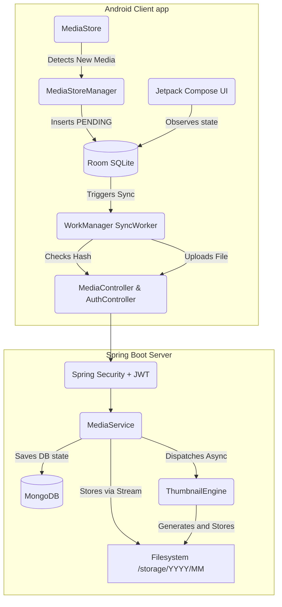

# ☁️ Nimbus: Your Personal Self-Hosted Photo Cloud

[](https://opensource.org/licenses/MIT)
[](https://spring.io/projects/spring-boot)
[](https://kotlinlang.org/)
[](https://www.docker.com/)

**Nimbus** is a production-grade, self-hosted photo backup and gallery system, designed to give you full control over your media. It’s built to make local media handling feel smooth, fast, and distraction-free—like a private, localized version of Google Photos that runs on your own hardware.

---

## ⚡ Why Nimbus?

Most gallery apps today feel heavy, overcomplicated, or overly dependent on the cloud. Nimbus focuses on a simple, powerful goal: provide a clean, responsive way to browse, organize, and back up your photos and videos without compromising your privacy.

* **No Clutter**: A minimalist approach focused on what matters most.
* **Privacy First**: Your media stays on your hardware, not someone else's cloud.
* **Fluid Performance**: Inspired by Samsung’s OneUI Gallery for a premium, responsive feel.
* **Reliable Sync**: Automated background backups ensure your memories are always safe.

---

## ✨ Features

### 🎨 The Experience (UI/UX)
-  **Modern Android UI**: Built with Jetpack Compose, featuring smooth transitions and a premium feel.
-  **Fluid Navigation**: Swipe gestures, smooth zoom, and intuitive layout.
-  **OneUI Inspired**: A familiar, lightweight design optimized for responsiveness.
-  **Favorites & Albums**: Organize your media into personalized collections.
-  **Video Support**: Seamless playback of your favorite video memories.

### ⚙️ The Engine (Backend)
-  **Automatic Background Sync**: Uses Android `WorkManager` to detect and upload new media even when the app is closed.
-  **Intelligent De-duplication**: SHA-256 hashing ensures no redundant files are uploaded, saving storage space.
-  **Asynchronous Thumbnails**: Server-side thumbnail generation for lighting-fast gallery browsing.
-  **Secure by Design**: JWT-based authentication with refresh token support.
-  **Containerized Deployment**: One-command setup using Docker Compose.

---

## ⚙️ Stay in Control

Nimbus isn't just about backup; it's about making the app work for **you**. The dedicated settings page allows you to fine-tune your experience:

- 📶 **Smart Syncing**: Choose to sync only on Wi-Fi or while charging to save data and battery.
- 🧹 **Storage Cleaner**: Automatically free up space by removing local copies after a successful backup.
- 🌙 **Background Power**: Enable or disable background syncing to manage device performance.
- 🗑️ **Manage with Ease**: Quick access to your **Favorites** and **Trash** for seamless organization.

---

## 🛠️ Tech Stack

<details>
<summary><b>Frontend (Android)</b></summary>

- **Language**: Kotlin
- **UI**: Jetpack Compose + Material 3
- **DI**: Hilt (Dagger)
- **DB**: Room (SQLite)
- **Concurrency**: Coroutines & Flow
- **Background**: WorkManager
- **Networking**: Retrofit + OkHttp
- **Media**: Coil (Image) & Media3 ExoPlayer (Video)
</details>

<details>
<summary><b>Backend & Infra</b></summary>

- **Language**: Java 17
- **Framework**: Spring Boot 3
- **DB**: MongoDB (Spring Data)
- **Security**: Spring Security + JWT
- **Containers**: Docker & Docker Compose
</details>

---

## 🏗️ Architecture

Nimbus follows a robust architecture to ensure data integrity and performance.



---

## 🚀 Quick Start

### 1. Prerequisites
- Docker & Docker Compose
- Android Studio (for client)

### 2. Backend Setup
1. Create a `.env` file in the root directory (see `.env.template`).
2. Start the services:
   ```bash
   docker compose up -d --build
   ```

### 3. Client Setup
1. Open the `client` folder in Android Studio.
2. Update `ApiClient.BASE_URL` to your server's IP (e.g., `http://192.168.1.xxx:8080`).
3. Build and Run!

---

## 🤝 Contributing
Please feel free to submit a Pull Request. We appreciate all contributions that improve UI smoothness or backend performance!

## 📄 License
This project is licensed under the MIT License - see the [LICENSE](LICENSE) file for details.
