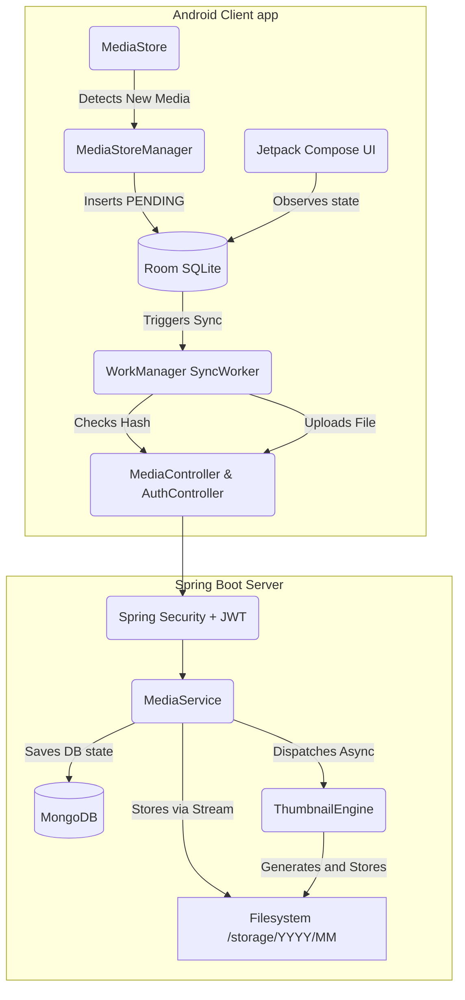

# Local Photo Backup Architecture

This system resembles a localized version of Google Photos, utilizing a robust Android client that periodically syncs local media to a self-hosted Spring Boot server.

## Flow of Upload
1. A photo is taken and discovered by `MediaStoreManager`.
2. It's stored in `Room` database as `PENDING`.
3. `SyncManager` schedules `SyncWorker`.
4. `SyncWorker` reads the local file, hashes it locally using SHA-256 (`HashUtils.kt`).
5. Client issues a `GET /api/media/hash/{hash}`.
6. If server returns `{exists: false}`, the client proceeds to send a `POST /api/media/upload` with the file chunk.
7. Server stores the file physically, creates DB metadata, and offloads thumbnail generation asynchronously.
8. Server returns HTTP 201.
9. Client updates Room DB state to `SUCCESS`, updating the UI in real-time.
